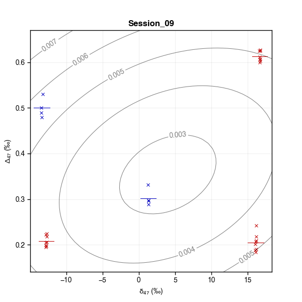
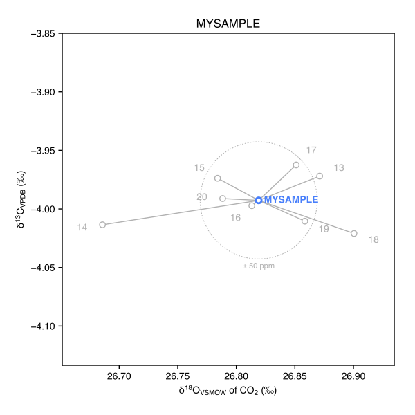

# 2. How-to

## 2.1 Simulate a virtual data set to play with

It is sometimes convenient to quickly build a virtual data set of analyses, for instance to assess the final analytical precision achievable for a given combination of anchor and unknown analyses (see also Fig. 6 of [Daëron, 2021](https://doi.org/10.1029/2020GC009592)).

This can be achieved with `virtual_data()`. The example below creates a dataset with four sessions, each of which comprises three analyses of anchor ETH-1, three of ETH-2, three of ETH-3, and three analyses each of two unknown samples named `FOO` and  `BAR` with an arbitrarily defined isotopic composition. Analytical repeatabilities for Δ47 and Δ48 are also specified arbitrarily. See the `virtual_data()` documentation for additional configuration parameters.

```py
.. include:: ../code_examples/virtual_data/example.py
```

## 2.2 Control data quality

`D47crunch` offers several tools to visualize processed data. The examples below use the same virtual data set, generated with:

```py
.. include:: ../code_examples/data_quality/example.py
```

### 2.2.1 Plotting the distribution of analyses through time

```py
data47.plot_distribution_of_analyses(filename = 'time_distribution.pdf')
```


The plot above shows the succession of analyses as if they were all distributed at regular time intervals. See `D4xdata.plot_distribution_of_analyses()` for how to plot analyses as a function of “true” time (based on the `TimeTag` for each analysis).

### 2.2.2 Generating session plots

```py
data47.plot_sessions()
```

Below is one of the resulting sessions plots. Each cross marker is an analysis. Anchors are in red and unknowns in blue. Short horizontal lines show the nominal Δ47 value for anchors, in red, or the average Δ47 value for unknowns, in blue (overall average for all sessions). Curved grey contours correspond to Δ47 standardization errors in this session.



### 2.2.3 Plotting Δ47 or Δ48 residuals

```py
data47.plot_residuals(filename = 'residuals.pdf', kde = True)
```


Again, note that this plot only shows the succession of analyses as if they were all distributed at regular time intervals.

### 2.2.4 Checking δ13C and δ18O dispersion

```py
mydata = D47data(virtual_data(
	session = 'mysession',
	samples = [
		dict(Sample = 'ETH-1', N = 4),
		dict(Sample = 'ETH-2', N = 4),
		dict(Sample = 'ETH-3', N = 4),
		dict(Sample = 'MYSAMPLE', N = 8, D47 = 0.6, D48 = 0.1, d13C_VPDB = -4.0, d18O_VPDB = -12.0),
	], seed = 123))

mydata.refresh()
mydata.wg()
mydata.crunch()
mydata.plot_bulk_compositions()
```

`D4xdata.plot_bulk_compositions()` produces a series of plots, one for each sample, and an additional plot with all samples together. For example, here is the plot for sample `MYSAMPLE`:




## 2.3 Use a different set of anchors, change anchor nominal values, and/or change oxygen-17 correction parameters

Nominal values for various carbonate standards are defined in four places:

* `D4xdata.Nominal_d13C_VPDB`
* `D4xdata.Nominal_d18O_VPDB`
* `D47data.Nominal_D4x` (also accessible through `D47data.Nominal_D47`)
* `D48data.Nominal_D4x` (also accessible through `D48data.Nominal_D48`)

17O correction parameters are defined by:

* `D4xdata.R13_VPDB`
* `D4xdata.R18_VSMOW`
* `D4xdata.R18_VPDB`
* `D4xdata.LAMBDA_17`
* `D4xdata.R17_VSMOW`
* `D4xdata.R17_VPDB`

When creating a new instance of `D47data` or `D48data`, the current values of these variables are copied as properties of the new object. Applying custom values for, e.g., `R17_VSMOW` and `Nominal_D47` can thus be done in several ways:

**Option 1:** by redefining `D4xdata.R17_VSMOW` and `D47data.Nominal_D47` _before_ creating a `D47data` object:

```py
from D47crunch import D4xdata, D47data

# redefine R17_VSMOW:
D4xdata.R17_VSMOW = 0.00037 # new value

# redefine R17_VPDB for consistency:
D4xdata.R17_VPDB = D4xdata.R17_VSMOW * (D4xdata.R18_VPDB/D4xdata.R18_VSMOW) ** D4xdata.LAMBDA_17

# edit Nominal_D47 to only include ETH-1/2/3:
D47data.Nominal_D4x = {
	a: D47data.Nominal_D4x[a]
	for a in ['ETH-1', 'ETH-2', 'ETH-3']
	}
# redefine ETH-3:
D47data.Nominal_D4x['ETH-3'] = 0.600

# only now create D47data object:
mydata = D47data()

# check the results:
print(mydata.R17_VSMOW, mydata.R17_VPDB)
print(mydata.Nominal_D47)
# NB: mydata.Nominal_D47 is just an alias for mydata.Nominal_D4x

# should print out:
# 0.00037 0.00037599710894149464
# {'ETH-1': 0.2052, 'ETH-2': 0.2085, 'ETH-3': 0.6}
```

**Option 2:** by redefining `R17_VSMOW` and `Nominal_D47` _after_ creating a `D47data` object:

```py
from D47crunch import D47data

# first create D47data object:
mydata = D47data()

# redefine R17_VSMOW:
mydata.R17_VSMOW = 0.00037 # new value

# redefine R17_VPDB for consistency:
mydata.R17_VPDB = mydata.R17_VSMOW * (mydata.R18_VPDB/mydata.R18_VSMOW) ** mydata.LAMBDA_17

# edit Nominal_D47 to only include ETH-1/2/3:
mydata.Nominal_D47 = {
	a: mydata.Nominal_D47[a]
	for a in ['ETH-1', 'ETH-2', 'ETH-3']
	}
# redefine ETH-3:
mydata.Nominal_D47['ETH-3'] = 0.600

# check the results:
print(mydata.R17_VSMOW, mydata.R17_VPDB)
print(mydata.Nominal_D47)

# should print out:
# 0.00037 0.00037599710894149464
# {'ETH-1': 0.2052, 'ETH-2': 0.2085, 'ETH-3': 0.6}
```

The two options above are equivalent, but the latter provides a simple way to compare different data processing choices:

```py
from D47crunch import D47data

# create two D47data objects:
foo = D47data()
bar = D47data()

# modify foo in various ways:
foo.LAMBDA_17 = 0.52
foo.R17_VSMOW = 0.00037 # new value
foo.R17_VPDB = foo.R17_VSMOW * (foo.R18_VPDB/foo.R18_VSMOW) ** foo.LAMBDA_17
foo.Nominal_D47 = {
	'ETH-1': foo.Nominal_D47['ETH-1'],
	'ETH-2': foo.Nominal_D47['ETH-1'],
	'IAEA-C2': foo.Nominal_D47['IAEA-C2'],
	'INLAB_REF_MATERIAL': 0.666,
	}

# now import the same raw data into foo and bar:
foo.read('rawdata.csv')
foo.wg()          # compute δ13C, δ18O of working gas
foo.crunch()      # compute all δ13C, δ18O and raw Δ47 values
foo.standardize() # compute absolute Δ47 values

bar.read('rawdata.csv')
bar.wg()          # compute δ13C, δ18O of working gas
bar.crunch()      # compute all δ13C, δ18O and raw Δ47 values
bar.standardize() # compute absolute Δ47 values

# and compare the final results:
foo.table_of_samples(verbose = True, save_to_file = False)
bar.table_of_samples(verbose = True, save_to_file = False)
```

## 2.4 Process paired Δ47 and Δ48 values

Purely in terms of data processing, it is not obvious why Δ47 and Δ48 data should not be handled separately. For now, `D47crunch` uses two independent classes — `D47data` and `D48data` — which crunch numbers and deal with standardization in very similar ways. The following example demonstrates how to print out combined outputs for `D47data` and `D48data`.

```py
from D47crunch import *

# generate virtual data:
args = dict(
	samples = [
		dict(Sample = 'ETH-1', N = 3),
		dict(Sample = 'ETH-2', N = 3),
		dict(Sample = 'ETH-3', N = 3),
		dict(Sample = 'FOO', N = 3,
			d13C_VPDB = -5., d18O_VPDB = -10.,
			D47 = 0.3, D48 = 0.15),
		], rD47 = 0.010, rD48 = 0.030)

session1 = virtual_data(session = 'Session_01', **args)
session2 = virtual_data(session = 'Session_02', **args)

# create D47data instance:
data47 = D47data(session1 + session2)

# process D47data instance:
data47.crunch()
data47.standardize()

# create D48data instance:
data48 = D48data(data47) # alternatively: data48 = D48data(session1 + session2)

# process D48data instance:
data48.crunch()
data48.standardize()

# output combined results:
table_of_sessions(data47, data48)
table_of_samples(data47, data48)
table_of_analyses(data47, data48)
```

Expected output:

```
––––––––––  ––  ––  –––––––––––  ––––––––––––  ––––––  ––––––  ––––––  –––––––––––––  –––––––––––––––  ––––––––––––––  ––––––  –––––––––––––  –––––––––––––––  ––––––––––––––
Session     Na  Nu  d13Cwg_VPDB  d18Owg_VSMOW  r_d13C  r_d18O   r_D47      a_47 ± SE  1e3 x b_47 ± SE       c_47 ± SE   r_D48      a_48 ± SE  1e3 x b_48 ± SE       c_48 ± SE
––––––––––  ––  ––  –––––––––––  ––––––––––––  ––––––  ––––––  ––––––  –––––––––––––  –––––––––––––––  ––––––––––––––  ––––––  –––––––––––––  –––––––––––––––  ––––––––––––––
Session_01   9   3       -4.000        26.000  0.0000  0.0000  0.0098  1.021 ± 0.019   -0.398 ± 0.260  -0.903 ± 0.006  0.0486  0.540 ± 0.151    1.235 ± 0.607  -0.390 ± 0.025
Session_02   9   3       -4.000        26.000  0.0000  0.0000  0.0090  1.015 ± 0.019    0.376 ± 0.260  -0.905 ± 0.006  0.0186  1.350 ± 0.156   -0.871 ± 0.608  -0.504 ± 0.027
––––––––––  ––  ––  –––––––––––  ––––––––––––  ––––––  ––––––  ––––––  –––––––––––––  –––––––––––––––  ––––––––––––––  ––––––  –––––––––––––  –––––––––––––––  ––––––––––––––


––––––  –  –––––––––  ––––––––––  ––––––  ––––––  ––––––––  ––––––  ––––––––  ––––––  ––––––  ––––––––  ––––––  ––––––––
Sample  N  d13C_VPDB  d18O_VSMOW     D47      SE    95% CL      SD  p_Levene     D48      SE    95% CL      SD  p_Levene
––––––  –  –––––––––  ––––––––––  ––––––  ––––––  ––––––––  ––––––  ––––––––  ––––––  ––––––  ––––––––  ––––––  ––––––––
ETH-1   6       2.02       37.02  0.2052                    0.0078            0.1380                    0.0223          
ETH-2   6     -10.17       19.88  0.2085                    0.0036            0.1380                    0.0482          
ETH-3   6       1.71       37.45  0.6132                    0.0080            0.2700                    0.0176          
FOO     6      -5.00       28.91  0.3026  0.0044  ± 0.0093  0.0121     0.164  0.1397  0.0121  ± 0.0255  0.0267     0.127
––––––  –  –––––––––  ––––––––––  ––––––  ––––––  ––––––––  ––––––  ––––––––  ––––––  ––––––  ––––––––  ––––––  ––––––––


–––  ––––––––––  ––––––  –––––––––––  ––––––––––––  –––––––––  –––––––––  ––––––––––  ––––––––––  ––––––––––  ––––––––––  ––––––––––  –––––––––  –––––––––  –––––––––  ––––––––  ––––––––
UID     Session  Sample  d13Cwg_VPDB  d18Owg_VSMOW        d45        d46         d47         d48         d49   d13C_VPDB  d18O_VSMOW     D47raw     D48raw     D49raw       D47       D48
–––  ––––––––––  ––––––  –––––––––––  ––––––––––––  –––––––––  –––––––––  ––––––––––  ––––––––––  ––––––––––  ––––––––––  ––––––––––  –––––––––  –––––––––  –––––––––  ––––––––  ––––––––
1    Session_01   ETH-1       -4.000        26.000   6.018962  10.747026   16.120787   21.286237   27.780042    2.020000   37.024281  -0.708176  -0.316435  -0.000013  0.197297  0.087763
2    Session_01   ETH-1       -4.000        26.000   6.018962  10.747026   16.132240   21.307795   27.780042    2.020000   37.024281  -0.696913  -0.295333  -0.000013  0.208328  0.126791
3    Session_01   ETH-1       -4.000        26.000   6.018962  10.747026   16.132438   21.313884   27.780042    2.020000   37.024281  -0.696718  -0.289374  -0.000013  0.208519  0.137813
4    Session_01   ETH-2       -4.000        26.000  -5.995859  -5.976076  -12.700300  -12.210735  -18.023381  -10.170000   19.875825  -0.683938  -0.297902  -0.000002  0.209785  0.198705
5    Session_01   ETH-2       -4.000        26.000  -5.995859  -5.976076  -12.707421  -12.270781  -18.023381  -10.170000   19.875825  -0.691145  -0.358673  -0.000002  0.202726  0.086308
6    Session_01   ETH-2       -4.000        26.000  -5.995859  -5.976076  -12.700061  -12.278310  -18.023381  -10.170000   19.875825  -0.683696  -0.366292  -0.000002  0.210022  0.072215
7    Session_01   ETH-3       -4.000        26.000   5.742374  11.161270   16.684379   22.225827   28.306614    1.710000   37.450394  -0.273094  -0.216392  -0.000014  0.623472  0.270873
8    Session_01   ETH-3       -4.000        26.000   5.742374  11.161270   16.660163   22.233729   28.306614    1.710000   37.450394  -0.296906  -0.208664  -0.000014  0.600150  0.285167
9    Session_01   ETH-3       -4.000        26.000   5.742374  11.161270   16.675191   22.215632   28.306614    1.710000   37.450394  -0.282128  -0.226363  -0.000014  0.614623  0.252432
10   Session_01     FOO       -4.000        26.000  -0.840413   2.828738    1.328380    5.374933    4.665655   -5.000000   28.907344  -0.582131  -0.288924  -0.000006  0.314928  0.175105
11   Session_01     FOO       -4.000        26.000  -0.840413   2.828738    1.302220    5.384454    4.665655   -5.000000   28.907344  -0.608241  -0.279457  -0.000006  0.289356  0.192614
12   Session_01     FOO       -4.000        26.000  -0.840413   2.828738    1.322530    5.372841    4.665655   -5.000000   28.907344  -0.587970  -0.291004  -0.000006  0.309209  0.171257
13   Session_02   ETH-1       -4.000        26.000   6.018962  10.747026   16.140853   21.267202   27.780042    2.020000   37.024281  -0.688442  -0.335067  -0.000013  0.207730  0.138730
14   Session_02   ETH-1       -4.000        26.000   6.018962  10.747026   16.127087   21.256983   27.780042    2.020000   37.024281  -0.701980  -0.345071  -0.000013  0.194396  0.131311
15   Session_02   ETH-1       -4.000        26.000   6.018962  10.747026   16.148253   21.287779   27.780042    2.020000   37.024281  -0.681165  -0.314926  -0.000013  0.214898  0.153668
16   Session_02   ETH-2       -4.000        26.000  -5.995859  -5.976076  -12.715859  -12.204791  -18.023381  -10.170000   19.875825  -0.699685  -0.291887  -0.000002  0.207349  0.149128
17   Session_02   ETH-2       -4.000        26.000  -5.995859  -5.976076  -12.709763  -12.188685  -18.023381  -10.170000   19.875825  -0.693516  -0.275587  -0.000002  0.213426  0.161217
18   Session_02   ETH-2       -4.000        26.000  -5.995859  -5.976076  -12.715427  -12.253049  -18.023381  -10.170000   19.875825  -0.699249  -0.340727  -0.000002  0.207780  0.112907
19   Session_02   ETH-3       -4.000        26.000   5.742374  11.161270   16.685994   22.249463   28.306614    1.710000   37.450394  -0.271506  -0.193275  -0.000014  0.618328  0.244431
20   Session_02   ETH-3       -4.000        26.000   5.742374  11.161270   16.681351   22.298166   28.306614    1.710000   37.450394  -0.276071  -0.145641  -0.000014  0.613831  0.279758
21   Session_02   ETH-3       -4.000        26.000   5.742374  11.161270   16.676169   22.306848   28.306614    1.710000   37.450394  -0.281167  -0.137150  -0.000014  0.608813  0.286056
22   Session_02     FOO       -4.000        26.000  -0.840413   2.828738    1.324359    5.339497    4.665655   -5.000000   28.907344  -0.586144  -0.324160  -0.000006  0.314015  0.136535
23   Session_02     FOO       -4.000        26.000  -0.840413   2.828738    1.297658    5.325854    4.665655   -5.000000   28.907344  -0.612794  -0.337727  -0.000006  0.287767  0.126473
24   Session_02     FOO       -4.000        26.000  -0.840413   2.828738    1.310185    5.339898    4.665655   -5.000000   28.907344  -0.600291  -0.323761  -0.000006  0.300082  0.136830
–––  ––––––––––  ––––––  –––––––––––  ––––––––––––  –––––––––  –––––––––  ––––––––––  ––––––––––  ––––––––––  ––––––––––  ––––––––––  –––––––––  –––––––––  –––––––––  ––––––––  ––––––––
```
